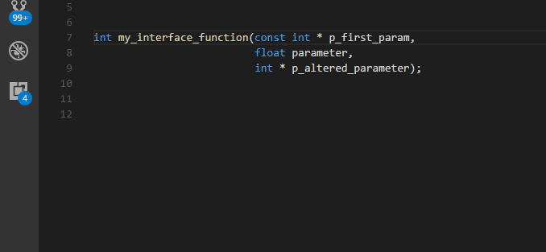
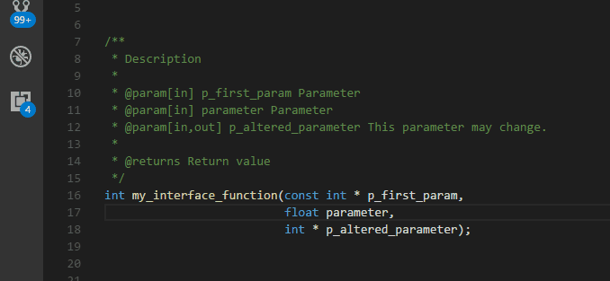

# Doxygen Generator for C/C++ functions

Generate function doxygen snippets for C and C++ functions.

## Features

Generate a Doxygen snippet documenting a C or C++ function. Pressing `Alt+Q` (or running the `Doxygen: Generate` command) creates a snippet with tabstops for the description, each parameter and the return value if the function has any.

If the function already has a documentation comment, the plugin will make the existing description a placeholder, and updates the parameter list.

### Syntax highlighting

Now supports syntax highlighting for doxygen!

## Known Issues

- The format of the doxygen block is not fully configurable. It enforces `@` for tags and block comments.
- Not tested properly for C++ scope-setting (`::`).
- Missing support for other languages.

## Release Notes

See separate file.